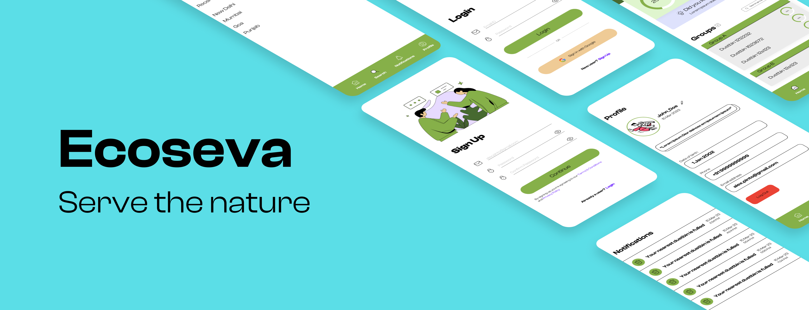
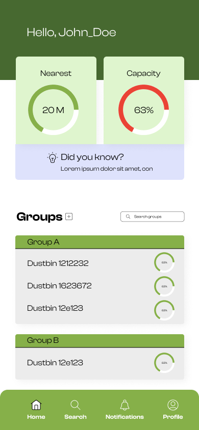
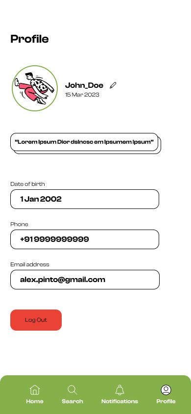
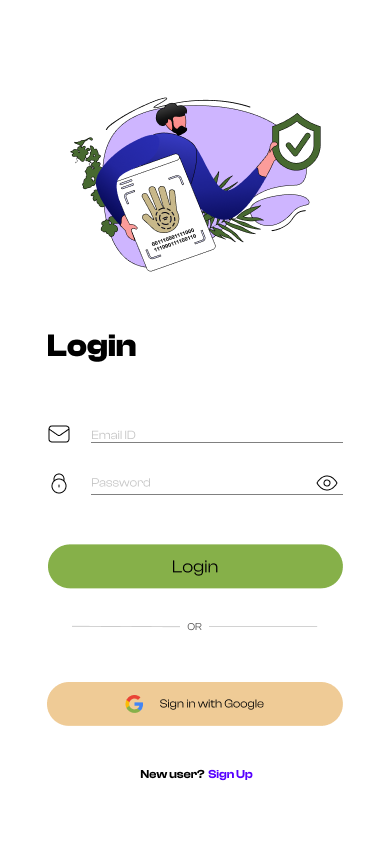

An innovative solution for effective and sustainable waste management.
  
 
 
 
 
 
 
 
 
 
 

## Table of Contents

- [Inspiration](#inspiration)
- [What it does?](#what-it-does)
- [Benefits](#benefits)
- [How we built it?](#how-we-built-it)
- [Challenges we ran into?](#challenges-we-ran-into)
- [Accomplishments that we're proud of?](#accomplishments-that-were-proud-of)
- [What we learned?](#what-we-learned)
- [Future Scopes](#future-scopes)
- [Screenshots Time](#screenshots-time)
- [Revenue Point](#revenue-point)
- [License](#license)

## Inspiration

During our visit to Goa, we noticed a pressing need for a modern waste management system. We observed that the existing waste disposal system was inadequate, with a single trash can being used to dump both biodegradable and non-biodegradable waste. We also found that even in the areas where separate bins were provided, the contents inside them did not correspond to the intended waste types. Moreover, overfilled trash cans were a common sight, and there were no designated areas to dispose of waste.

This experience inspired us to take action and promote waste segregation. We realized that with the help of modern technology, we could make a significant impact in waste management. Specifically, we could leverage the power of AI and computer vision to build advanced waste segregation units. These units could identify and separate different types of waste automatically, thereby reducing the risk of contamination and increasing the efficiency of waste management.

By integrating these AI-based waste segregation units into existing waste management systems, we could significantly reduce the amount of non-biodegradable waste and promote recycling. This would not only make our surroundings cleaner and more hygienic but would also promote sustainability and a healthier environment for all.

## What it does?

Ecoseva is an AI-based trash segregation that revolutionises the waste management industry. With our cutting-edge system, we use a real-time camera module connected to a custom-designed convolutional neural network, which triggers various mechanical components, including a servo motor-based segregation flap, to sort waste into its respective categories. This is supported by state-of-the-art ultrasonic sensors that monitor the trash bin's capacity in real-time, viewable through our cross-platform app and website.

Our user-friendly app and website are also equipped with a GPS locator, enabling users to quickly and conveniently locate nearby dustbins for proper waste disposal. Additionally, our smart unit contains a 100% touchless proximity sensor-based opening flap, which promotes hygienic and contactless waste disposal, minimising the spread of germs.

Our solution is cost-effective and efficient, allowing businesses and communities to reduce waste disposal fees, decrease landfill usage, and promote environmental sustainability. By investing in our company, you can help us take a step towards a cleaner and more sustainable future.

### Benefits

Using an article from economic times we have studied that,
<https://m.economictimes.com/news/india/govt-allocates-rs-40700-crore-for-waste-management-in-2-lakh-villages-under-swacch-bharat-mission/articleshow/83342990.cms>

Government has allocated 40700 crore rupees for waste management. This plan includes 2 parts: liquid waste management and solid waste management. With our solution the costs for solid waste management could be reduced as the need for manual labour would be reduced for segregating waste in different categories.

Our current solution will help in waste management by dividing the waste into two categories: biodegradable and non-biodegradable at the source of trash generation.

[Waste Management | The Official Website of Ministry of Environment, Forest and Climate Change, Government of India (moef.gov.in)](https://moef.gov.in/en/service/environment/waste-management/)

According to the above document the Indian government has emphasised on managing waste through a sustainable business model which includes segregation of municipal solid waste at source, door-to-door collection by involving waste collectors and processing segregated waste into useful products such as methane and compost. By using our product the government can help reduce costs for this business model as our product basically helps segregating waste at its source.

Our solution can be used by the government in public places like bus addas, metro stations, and airports. Private companies can also use our solution for waste management inside their campus.

Our solution also provides people with an app and website to find out their nearest empty waste segregation unit and use it.

## How we built it?

  

The mobile app is built using Flutter. The backend is built using Django and the AI model is built using Keras and Tensorflow. The backend is dockerised and deployed on DigitalOcean.

To develop our proof of concept, we utilized cardboard for the casing, which is an easily accessible and manageable material. Our current design incorporates one IR sensor, two ultrasonic sensors, two micro servos, and two Arduino Uno R3s.

We implemented the IR sensor to create a touchless lid for our dustbin by utilizing a servo motor to open and close it. The two ultrasonic sensors were employed to calculate the proportion of both the biodegradable and non-biodegradable sections of the dustbin. This helps prevent the issue of overflowing in our waste segregation unit. The final servo motor operates an internal flap, which aids in determining the correct trash bin for the waste to be deposited into.

## Challenges we ran into?

Even though our team had knowledge of various techstacks, we still had quite a hurdles.

[Biswa](https://github.com/2002Bishwajeet) - For him, it was his first time creating such an extensive Flutter App with multiple modules and AI integration. He worked on UI and connecting the backend with the frontend. He also helped in setting up the backend in the digital ocean droplet.

[Harsh](https://github.com/harshsH-28) - For him, working with docker was a first time experience and he designed the UI of the whole website in 24 Hours. He worked with Typescript for the first time in a Hackathon and learnt many new concepts of Typescript along the whole journey. 
  
[Khushiyant](https://github.com/Khushiyant) - He worked on designing the UI in Figma and that it was his first time using the software. He also dockerised the application which was a difficult task as he had to compose two backends.

[Vidhu](https://github.com/Kranium2002) - For him, it was creating and managing the arduino side of the project and incorporating all the sensors into one package to be used by our custom machine learning model
  
## Accomplishments that we're proud of?

We are proud that this is our first IoT project and we are able to make a working protoype during the hackathon.

Successfully integrating the classification model which allows to segregate waste into two categories: biodegradable and non-biodegradable.

Sending data back and forth between the app and the backend and the backend and the device.

## What we learned?

Everyone learned something.

- **Biswa** learned about deploying and setting up a production server and making a complex UI.

- **Harsh** learned how to handle FitBit API and how to integrate AI with his app.

- **Khushiyant** learned more about containerized server with Docker.

- **Vidhu** learned how to use Arduino with machine learning.

## Future Scopes

The future scope of the project could involve enhancing the current design by incorporating additional features and technologies. For instance:

Cloud Connectivity: The dustbin could be connected to the cloud to facilitate seamless data transfer, analysis, and storage. This could aid in the creation of a more efficient waste management system.

Renewable Energy Integration: Solar panels or other renewable energy sources could be incorporated to power the sensors and microcontrollers.

Smart Routing System: The dustbin could be integrated into a smart routing system that enables the collection and disposal of waste more efficiently.

## Screenshots Time

  

## Revenue Point
  
Our revenue model involves charging buyers on a per unit basis for the dustbins. Additionally, we will offer a maintenance service plan to assist our B2B clients with data drifting issues.

It's important to note that our business model is distinct from that of the traditional large, colored dustbins used for bulk waste collection. Instead, we draw inspiration from the water bottle recycling stations that are commonly found in public areas like airports.

## License

This project is GNU [Licensed](./LICENSE)
